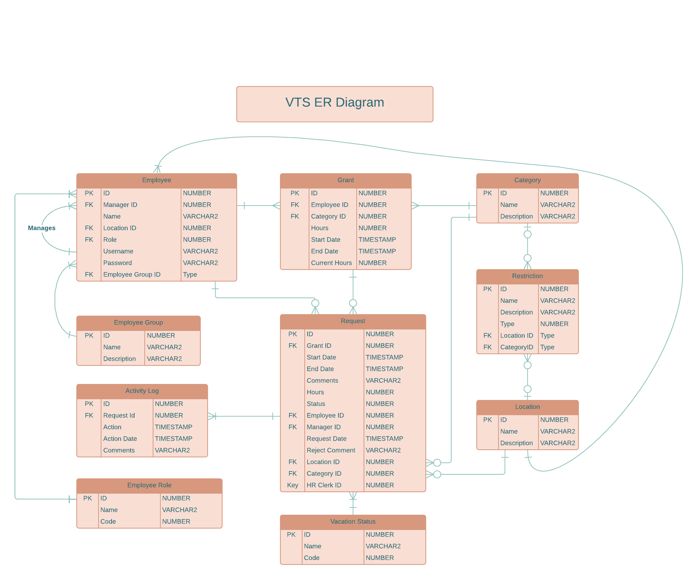

# Vacation Tracking System (VTS) Analysis and Design

## Overview

### The Vacation Sysytem Idea is presented in the [Object Oriented Analysis And Design textbook, 3rd edition](https://www.oreilly.com/library/view/object-oriented-analysis-and/9780201895513/).

This README provides an overview of the analysis and design of the Vacation Tracking System (VTS), aimed at improving internal business processes related to managing vacation time requests.

The Repository is a part of collaborative work production in a 6-Month Mentorship program under the supervision of [Eng.Ahmed Emad](https://www.linkedin.com/in/ahmed-emad-abdelall/).

## Problem Statement

The manual process of approving vacation time requests is time-consuming, involving multiple levels of approval and checks. The goal is to automate this process to improve efficiency, with at most one manual approval required by the immediate manager.

## Vision

VTS will empower individual employees to manage their vacation time, sick leave, and personal time off efficiently, without extensive knowledge of company policies. It will streamline the process and reduce the time required for approval.

## Nonfunctional Requirements

- Develop the VTS as a web application for ease of access.
- Ensure the application is user-friendly.
- Utilize existing hardware and middleware to minimize additional infrastructure requirements.

## Functional Requirements

- Implement a rules-based system for validating and verifying leave time requests.
- Enable manager approval, if required.
- Provide access to previous calendar year requests and allow requests up to a year and a half in advance.
- Utilize email notifications for manager approval and request status changes.
- Maintain activity logs for all transactions.
- Allow HR and system administration personnel to override actions with appropriate logging.
- Enable managers to directly award personal leave time within system-set limits.
- Provide a Web service interface for querying an employee’s vacation request summary.
- Interface with HR department legacy systems for employee information retrieval and updates.

## Constraints

- Utilize existing hardware and middleware.
- Integrate the system as an extension to the existing intranet portal, utilizing single sign-on mechanisms.
- Ensure seamless integrations and user experience.

## Actors

- **Employee**: Manages own vacation time requests.
- **Manager**: Approves vacation requests for subordinates and can award comp time.
- **Clerk**: HR department member responsible for managing employee data.
- **System Admin**: Oversees technical resources and log file management.

## Domain Knowledge

- Employees work eight-hour days.
- Vacation time requests adhere to primary work location policies.
- Validation rules for vacation time requests are defined by the HR department.

## Main Use Cases

### 1. [Manage Time](https://github.com/HendMuhmmad/VacationTrackingSystem/tree/master/Manage%20Time)
- **Actor**: Employee, Manager, Hr Clerk
- **Goal**: Submit a new vacation time request.
- **Preconditions**: Authenticated as an employee with privileges to manage own vacation time.

### 2. [Cancel Approved Request](https://github.com/HendMuhmmad/VacationTrackingSystem/tree/master/Cancel%20Approved%20Request)
- **Actor**: Employee
- **Goal**: Cancel an approved vacation time request.
- **Preconditions**: Have an approved request scheduled within the allowable timeframe.

### 3. [Edit Pending Request](https://github.com/HendMuhmmad/VacationTrackingSystem/tree/master/Edit%20Pending%20Request)
- **Actor**: Employee
- **Goal**: Edit details of a pending vacation time request.
- **Preconditions**: Have a pending request yet to be approved or denied.

### 4. [Withdraw Pending Request](https://github.com/HendMuhmmad/VacationTrackingSystem/tree/master/Withdraw%20Pending%20Request)
- **Actor**: Employee
- **Goal**: Withdraw a pending vacation time request.
- **Preconditions**: Have a pending request yet to be approved or denied.
  
## Diagrams and Pseudo Code

### Entity Relationdship Diagram

    

The project includes diagrams such as flow charts, sequence, object, and state diagrams, along with [pseudo code](https://github.com/HendMuhmmad/VacationTrackingSystem/blob/master/VTSpseudoCode.txt) for use cases, to facilitate object-oriented analysis and design.

For detailed analysis and design documentation, please refer to the corresponding files in the project repository.

Feel free to reach out with any questions or feedback!
